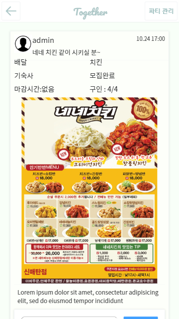

> Written with [StackEdit](https://stackedit.io/).

화면정의서 : ./img/WEB_Together_Solo1~3.jpg
PPT: ./WEB_Together_Solo.pptx

## logo


> 2019 OSAM Project Together


## 실행 환경
- Node.js : v10.16.3
- NPM : v6.12.0

**Dependencies**
- vue :  v2.5.11
- vue-page-transition : v0.2.2
- vue-resource : v1.5.1
- vue-router : v3.1.3
- vuex:  v3.1.1
- element-ui : v2.12.0

**Database**
- google firebase : https://vueresource-a3eb7.firebaseio.com/


## 설치 및 실행
```
git clone https://github.com/osam2019/WEB_Together_Solo.git
cd WEB_Together_Solo
npm install
npm run dev
```

## 프로젝트 개요

### 개발 동기

기숙사에 살거나 혼자 자취를 하는 대학생들은 혼자라서 손해보는 경우가 자주 생긴다. 예를 들어 배달을 시켜야 하는데 적은 양밖에 못시켜서 배달비를 내야하는 경우나 택시를 탈 때 혼자 내야하는 가격이 부담스러운 경우도 있다. 그들은 이 외에도 공동구매, 스터디 모집, 아르바이트 구인 등 여러가지 사람이 필요한 일들에 고통을 받는다.

 '투게더'는 빠르고 편리하게 인력을 매칭해서 이들의 고통을 덜어주는 역할을 할 수 있다.

**예시**


### 기능, 목적

페이스북에는 그런 고통받는 사람들의 구인글들이  항상 올라오지만 카테고리도 없고 시간순으로 정리도 안되어서 원하는 정보를 얻지 못할 때가 많다.

**게시판**


투게더는 그런 페이스북의 단점을 보완해줄 것이다. 구인 조건을 더 간결하게 표시하고 필터를 이용해 원하는 사용자가 원하는 정보를 빠르게 취할 수 있다.

**파티 생성과 가입**



게시글을 새로 생성하면 그 순간 파티(모임)가 새로 생성되고 게시자는 파티장이 된다. 사용자들은 댓글을 달아 가입요청을 하고 파티장은 가입승인을 할 수 있다.


조정이 필요한 경우 댓글을 단 사람과 1대1 채팅을 하여 일정, 장소 등을 조율 할 수 있다.

**파티 관리**


사이드바를 이용하면 현재 가입된 파티를 쉽게 확인하고 관리할 수 있다.


파티 관리창은 단체 채팅방이 존재하고 파티장은 파티원을 조정하고 파티를 해체할 수 있다.


## 파일 정보 및 목록 (File Manifest)
```
├── img 'Readme.md' 작성용 이미지 파일
├── public 이미지 파일
├── src
|   ├── assets 로고 이미지
|   ├── components 컴포넌트 뷰파일들이 있음
|	├── views 
|	├── data.js 가독성을 해치는 오브젝트 저장
|	└── store.js vuex 데이터 관리
|	
├── package.json
├── README.md
└── index.html
```

## 라이센스 정보
- MIT License
## 개발자
김건우(koimg8545@naver.com)
- 지상작전사령부 제 5군단 6보병사단 19연대 2대대 5중대
## Known Issue
- Database에는 게시글 데이터만 존재함

## Trouble Shooting
추후에 데이터 베이스 이용 예정

## Credit
Military Soldier Open SW Collective Education Program.

## Change Log

